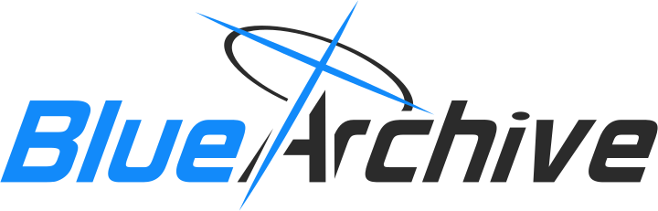

  

# BAcraft

 

 

 
A [Blue Archive](https://bluearchive.nexon.com/home) inspired minecraft mod bringing parts of Kivotos into the world of minecraft
 

## Key Features
> **Important Note**: While most, if not all, 'Key' features will be included, some may not be fully fleshed out in the initial release.
- **School infrastructure**: Discover key locations like the café and classrooms, each offering unique environments
- **Aesthetic Overhaul**: Custom textures, UI elements, and visual effects that capture the Blue Archive art style
- **School Effects**: Each school will influence gameplay in a meaningful way, reinforcing its affiliation through various mechanics
- **Custom items**: Experiment with a wide range of custom items to tailor your experience to your liking

## Project Status
> **Important Note**: This project is currently in a very early stage of development. Features may change,  be revamped or completely removed

Current Development Phase::
- [x] Core architecture design
- [x] Item registration system
- [ ] Visual school representation
- [ ] Textures & Assets
- [ ] Structures and buildings
- [ ] First enjoyable release

## License
APACHE-2.0 License - see [LICENSE](LICENSE)

